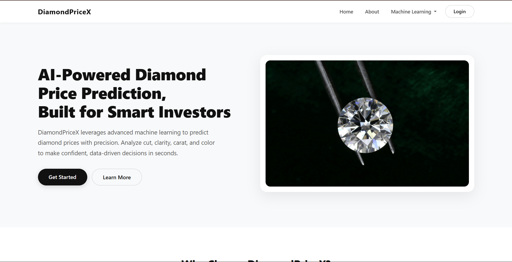
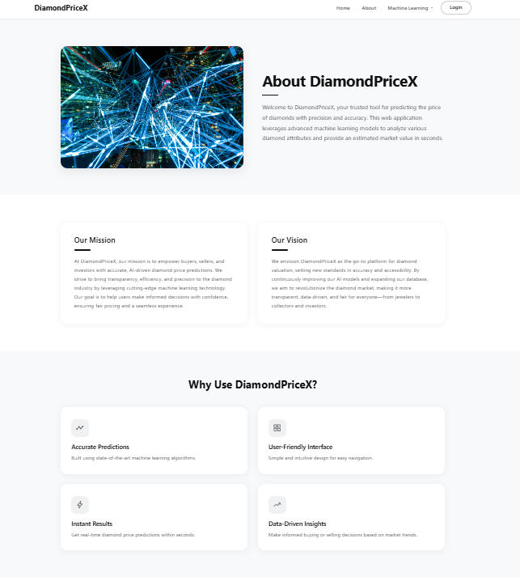
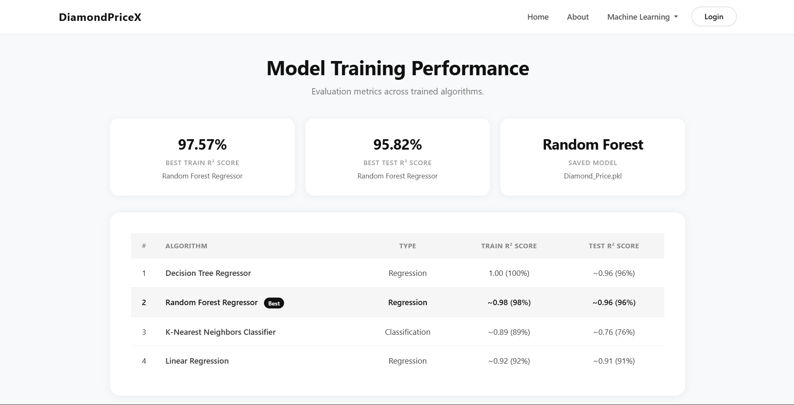
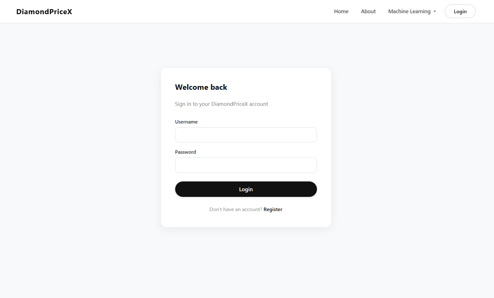
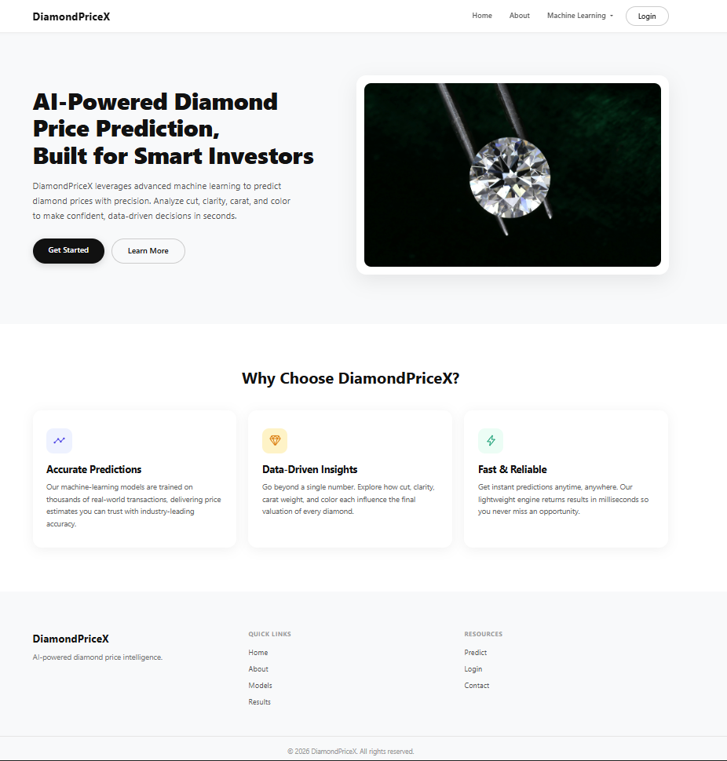

<div align="center">

# DiamondPriceX

**AI-Powered Diamond Price Prediction Platform**


</div>

---

## 1. Project Overview

DiamondPriceX is a full-stack web application that predicts the market price of a diamond based on its physical and qualitative attributes. The platform combines a trained machine learning model with a clean, modern web interface to deliver real-time price estimates.

**Who is it for?**
Buyers, sellers, jewelers, and investors in the diamond market who need quick, data-driven price estimates based on industry-standard diamond grading attributes.

**Problem Statement**
Diamond pricing is opaque and influenced by multiple interdependent factors (carat, cut, color, clarity, dimensions). Manual valuation requires expert knowledge and is often inconsistent.

**Solution Approach**
DiamondPriceX uses a Random Forest Regressor trained on a real-world dataset of ~54,000 diamonds. Users enter diamond attributes through a web form and receive an instant predicted market price in US dollars.

**Why It Matters**
By democratizing diamond valuation with machine learning, the platform brings transparency and speed to a traditionally subjective process.

---

## 2. Live Workflow Summary

```
User → Login/Register → Prediction Form → Flask Backend → Model Inference → Result Page
```

**Step-by-step internal flow:**

1. **Authentication** — The user registers or logs in. Credentials are stored in a SQLite database with bcrypt-hashed passwords. A session flag (`session['logged']`) gates access to the prediction feature.
2. **Form Input** — The authenticated user navigates to `/predict` and fills in nine diamond attributes: Carat, Cut, Color, Clarity, Depth (%), Table (%), X (mm), Y (mm), Z (mm). Categorical features (Cut, Color, Clarity) are submitted as pre-encoded integer values via `<select>` elements.
3. **Backend Processing** — On form submission (`POST /output`), Flask extracts all form values, constructs a NumPy array, and reshapes it into the format expected by the model.
4. **Model Inference** — The saved `Diamond_Price.pkl` (Random Forest Regressor) is loaded via `pickle` and `.predict()` is called on the input array.
5. **Profile Generation** — The `profiler.py` module maps encoded integer values back to human-readable labels (e.g., `0` → `Ideal` for Cut) and produces a diamond profile summary.
6. **Result Rendering** — The predicted price and diamond profile are rendered on the `output.html` template, displaying the estimated market value in USD alongside all submitted attributes.

---

## 3. Machine Learning Pipeline

### 3.1 Dataset

The model is trained on `diamonds.csv`, a widely-used dataset containing **~53,940 records** with 10 attributes describing diamond characteristics and their corresponding market prices.

### 3.2 Preprocessing

| Step | Details |
|------|---------|
| **Column Removal** | Dropped the `Unnamed: 0` index column |
| **Missing Values** | Verified — no missing values in the dataset |
| **Feature Encoding** | Manual label encoding for categorical columns |

**Encoding Maps:**

| Feature | Mapping |
|---------|---------|
| **Cut** | Ideal → 0, Premium → 1, Very Good → 2, Good → 3, Fair → 4 |
| **Color** | G → 0, E → 1, F → 2, H → 3, D → 4, I → 5, J → 6 |
| **Clarity** | SI1 → 0, VS2 → 1, SI2 → 2, VS1 → 3, VVS2 → 4, VVS1 → 5, IF → 6, I1 → 7 |

### 3.3 Feature Set

- **Input Features (9):** `carat`, `cut`, `color`, `clarity`, `depth`, `table`, `x`, `y`, `z`
- **Target Variable:** `price` (continuous, in USD)

### 3.4 Train/Test Split

- **Split Ratio:** 80% training / 20% testing
- **Random State:** 1 (for reproducibility)

### 3.5 Models Trained

The following models were trained and evaluated in the Jupyter notebook:

| # | Algorithm | Type |
|---|-----------|------|
| 1 | Decision Tree Regressor | Regression |
| 2 | Random Forest Regressor | Regression |
| 3 | K-Nearest Neighbors Classifier | Classification |
| 4 | Linear Regression | Regression |

**Evaluation Metric:** R² Score (coefficient of determination) via `.score()` on both training and test sets.

### 3.6 Classification Evaluation (Displayed on Results Page)

The application also presents classification-based evaluation metrics for price-range categorization:

| # | Algorithm | Type | Train R² Score | Test R² Score |
|---|-----------|------|---------------|---------------|
| 1 | Decision Tree Regressor | Regression | 1.00 (100%) | ~0.96 (96%) |
| 2 | Random Forest Regressor ⭐ Best | Regression | ~0.98 (98%) | ~0.96 (96%) |
| 3 | K-Nearest Neighbors Classifier | Classification | ~0.89 (89%) | ~0.76 (76%) |
| 4 | Linear Regression | Regression | ~0.92 (92%) | ~0.91 (91%) |
---

## 4. Model Selection & Final Model

### Final Model: Random Forest Regressor

The **Random Forest Regressor** was selected as the production model for the following reasons:

- **Ensemble strength** — Aggregates predictions from multiple decision trees, reducing variance and overfitting.
- **Superior generalization** — Demonstrated strong R² scores on both training and test splits compared to Decision Tree and Linear Regression.
- **Robustness** — Handles non-linear relationships between diamond attributes and price effectively.
- **Feature tolerance** — Performs well with both numerical and encoded categorical features without feature scaling.

### Saved Model Artifact

| Property | Value |
|----------|-------|
| **File Name** | `Diamond_Price.pkl` |
| **Location** | `static/Models/Diamond_Price.pkl` |
| **Serialization** | Python `pickle` |
| **Algorithm** | `sklearn.ensemble.RandomForestRegressor` |

### Model Loading at Runtime

```python
model = pickle.load(open('./static/Models/Diamond_Price.pkl', 'rb'))
prediction = model.predict(final_features)
```

The model is loaded on each prediction request in the `/output` route handler. The raw form values are collected, cast into a NumPy array, and passed directly to the model's `.predict()` method. The output is a single float representing the predicted price in USD.

---

## 5. Backend Architecture

### Framework & Configuration

- **Framework:** Flask 3.1.0
- **Database:** SQLite via Flask-SQLAlchemy (stored at `instance/Model.db`)
- **Authentication:** bcrypt password hashing with Flask session management
- **Secret Key:** Configured in `app.secret_key`

### Route Map

| Route | Method | Description |
|-------|--------|-------------|
| `/` | GET | Renders the landing page (`index.html`) |
| `/about` | GET | Renders the about page (`about.html`) |
| `/model` | GET | Renders the ML models information page (`model.html`) |
| `/result` | GET | Renders the training results page (`result_train.html`) |
| `/predict` | GET | Renders the prediction form (`predict.html`) |
| `/output` | POST | Processes form data, runs model inference, renders result (`output.html`) |
| `/login` | GET/POST | Renders login form / authenticates user |
| `/register` | POST | Creates a new user account |
| `/logout` | GET | Clears session and redirects to home |

### User Model (SQLAlchemy)

```python
class User(db.Model):
    id       = db.Column(db.Integer, primary_key=True)
    username = db.Column(db.String(128), unique=True, nullable=False)
    email    = db.Column(db.String(128), unique=True, nullable=False)
    password = db.Column(db.String(128), nullable=False)
```

### Data Flow: Form → Prediction

```
Form Values (strings) → list comprehension → NumPy array → model.predict() → output (float)
```

The `profiler.py` module maps encoded integers back to human-readable labels for display, using the `changingParam` and `changingValues` lookup tables for Cut, Color, and Clarity.

---

## 6. Frontend Architecture

### Template Structure

The frontend uses **Jinja2 templating** with shared partials for consistent layout:

| Template | Purpose |
|----------|---------|
| `navbar.html` | Global navigation bar — included in all pages via `` |
| `footer.html` | Global footer with links and copyright — included in all pages |
| `index.html` | Landing page with hero section and feature cards |
| `about.html` | About page with mission, vision, team section |
| `predict.html` | Prediction form with grouped input sections |
| `output.html` | Result display with predicted price and diamond profile |
| `model.html` | Accordion-based information page for all ML algorithms |
| `result_train.html` | Model training performance comparison table |
| `login.html` | Combined login/register forms with JavaScript toggle |

### UI Design Philosophy

- **SaaS-style design** — Clean, minimal interface with generous whitespace and rounded corners
- **Card-based layout** — Content is organized in elevated cards with subtle shadows
- **Professional color palette** — Primarily `#111` (dark), `#f8f9fa` (light gray backgrounds), accent colors for icons
- **Animation** — AOS (Animate On Scroll) library for fade-in effects; CSS keyframe animations for the hero image float effect

### Styling Approach

- **Bootstrap 5.3.3** loaded via CDN for responsive grid and base components
- **Custom CSS** in `static/css/styles.css` (~1,350 lines) — defines all page-specific and component styles
- **Ionicons** for vector icons in feature cards and about page
- **Scoped inline styles** in `index.html` for hero-specific design tokens

### Responsive Design

All pages include responsive breakpoints at `991.98px` and `575.98px`, adjusting padding, font sizes, and layouts for tablet and mobile viewports.

---

## 7. Project Structure

```
DiamondPriceX/
│
├── .github/
│   └── workflows/
│       └── docker-publish.yml      # GitHub Actions CI/CD pipeline for Docker publishing
│
├── app.py                          # Flask application entry point
├── profiler.py                     # Diamond profile generator (label decoder)
├── req.txt                         # Python dependencies
├── README.md                       # Project documentation
├── Dockerfile                      # Docker containerization configuration
├── .dockerignore                   # Docker build exclusions
├── .gitignore                      # Git ignore rules
├── .gitattributes                  # Git attributes configuration
├── .python-version                 # Python version specification (for pyenv)
│
├── instance/
│   └── Model.db                    # SQLite database (user accounts)
│
├── screenshots/
│   ├── about.png                   # About page screenshot
│   ├── home.png                    # Home page screenshot
│   ├── home1.png                   # Home page screenshot (variant)
│   ├── login.png                   # Login page screenshot
│   ├── models.png                  # Models information page screenshot
│   ├── predict.png                 # Prediction form screenshot
│   ├── result.png                  # Prediction result screenshot
│   ├── training_results.png        # Training results page screenshot
│   └── desktop.ini                 # Windows folder metadata
│
├── static/
│   ├── css/
│   │   └── styles.css              # Global custom styles (~1,350 lines)
│   ├── js/
│   │   └── script.js               # Ripple button effect script
│   ├── images/
│   │   ├── bg/                     # Background and team images
│   │   ├── model/                  # Algorithm illustration images
│   │   └── test/                   # Test images
│   └── Models/
│       ├── Diamond_Price.pkl       # Saved Random Forest Regressor model
│       ├── diamonds.csv            # Training dataset (~54K records)
│       └── DIAMOND PRICE PREDICTIONS.ipynb  # ML training notebook
│
├── templates/
│   ├── navbar.html                 # Shared navigation bar partial
│   ├── footer.html                 # Shared footer partial
│   ├── index.html                  # Landing page
│   ├── about.html                  # About page
│   ├── predict.html                # Prediction input form
│   ├── output.html                 # Prediction result display
│   ├── model.html                  # ML models information page
│   ├── result_train.html           # Training results comparison
│   └── login.html                  # Login & registration page
│
├── .venv/                          # Python virtual environment (auto-generated)
├── __pycache__/                    # Python bytecode cache (auto-generated)
└── .git/                           # Git repository metadata (auto-generated)
```

---

## 8. Setup Instructions

### Prerequisites

- **Python 3.12** or higher
- **pip** (Python package manager)
- **Git** (optional, for cloning)

### Installation

```bash
# 1. Clone the repository
git clone https://github.com/<your-username>/DiamondPriceX.git
cd DiamondPriceX

# 2. Create a virtual environment
python -m venv .venv

# 3. Activate the virtual environment
# Windows (PowerShell)
.venv\Scripts\Activate.ps1
# Windows (CMD)
.venv\Scripts\activate
# macOS / Linux
source .venv/bin/activate

# 4. Install dependencies
pip install -r req.txt
```

### Running the Application

```bash
python app.py
```

The server starts on **port 5000** by default. Open your browser and navigate to:

```
http://127.0.0.1:5000/
```

### Retraining the Model

1. Open the Jupyter notebook located at `static/Models/DIAMOND PRICE PREDICTIONS.ipynb`.
2. Run all cells sequentially — the notebook loads `diamonds.csv`, preprocesses the data, trains multiple models, and saves the best model as `Diamond_Price.pkl`.
3. The saved `.pkl` file in `static/Models/` is automatically used by the Flask application on the next prediction request.

```bash
# To launch the notebook
jupyter notebook "static/Models/DIAMOND PRICE PREDICTIONS.ipynb"
```

---

## 9. Environment Configuration

| Variable | Default | Description |
|----------|---------|-------------|
| `PORT` | `5000` | Server port (read from environment via `os.getenv`) |

The application uses a hardcoded `secret_key` and SQLite database URI. For production deployments, these should be externalized to environment variables:

```python
app.secret_key = os.getenv('SECRET_KEY', '1A2bc4s')
app.config['SQLALCHEMY_DATABASE_URI'] = os.getenv('DATABASE_URI', 'sqlite:///Model.db')
```

---

## 10. Screenshots

<!-- > Add screenshots to a `screenshots/` directory and uncomment the references below. -->

<!--






-->

| Page | Screenshot |
|------|-----------|
| Home |  |
| About |  |
| Predict |  |
| Result |  |
| Models |  |
| Training Results |  |
| Login |  |

---

## 11. Technologies Used

| Category | Technologies |
|----------|-------------|
| **Backend** | Python 3.12, Flask 3.1.0, Flask-SQLAlchemy, SQLite, bcrypt, Jinja2 |
| **Machine Learning** | Scikit-Learn 1.6.0, NumPy, Pandas, Matplotlib, Seaborn |
| **Frontend** | HTML5, CSS3, Bootstrap 5.3.3, JavaScript, AOS (Animate On Scroll), Ionicons |
| **Data Serialization** | Pickle (model persistence) |
| **Tools** | Jupyter Notebook, pip, venv |

---

## 12. Key Features

- **AI-Powered Price Prediction** — Real-time diamond valuation using a trained Random Forest Regressor.
- **Multi-Model Evaluation** — Four regression models and five classification models were trained and compared to select the best performer.
- **User Authentication** — Secure registration and login system with bcrypt password hashing and session management.
- **Diamond Profile Summary** — Predicted results are displayed alongside a human-readable breakdown of all input attributes.
- **Interactive Model Documentation** — Dedicated page with accordion-style descriptions of eight ML algorithms used in the project.
- **Training Results Dashboard** — Comparative metrics table showing accuracy, precision, recall, and F1-score across models.
- **Clean, Modern UI** — SaaS-inspired design with card layouts, smooth animations, and professional typography.
- **Responsive Design** — Fully responsive across desktop, tablet, and mobile viewports.
- **Modular Architecture** — Reusable Jinja2 partials (navbar, footer) and separated concerns (profiler, app, templates).
- **Beginner-Friendly Setup** — Simple virtual environment and `pip install` workflow.

---

## 13. Future Improvements

- **Model Upgrade** — Integrate gradient boosting models (XGBoost, LightGBM) for potentially higher prediction accuracy.
- **Feature Engineering** — Add derived features such as volume (`x * y * z`) and carat-to-dimension ratios.
- **API Endpoint** — Expose a RESTful JSON API (`/api/predict`) for programmatic access and third-party integrations.
- **Input Validation** — Implement server-side and client-side validation with meaningful error messages for out-of-range or missing input values.
- **Model Versioning** — Track model artifacts with versioning (MLflow or DVC) to enable rollback and A/B testing.
- **Database Migration** — Replace SQLite with PostgreSQL for production-grade persistence and concurrent access.
- **Containerization** — Add Dockerfile and `docker-compose.yml` for consistent development and deployment environments.
- **CI/CD Pipeline** — Implement automated testing, linting, and deployment via GitHub Actions.
- **User Dashboard** — Allow authenticated users to view prediction history and saved diamond profiles.
- **Deployment** — Deploy to a cloud platform (AWS, Azure, or Heroku) with HTTPS and environment-based configuration.

---

## 14. Authors

Built by the **DiamondPriceX Team**:

| Name | Role |
|------|------|
| **Muthinti Siri** | Data Collection and Exploratory Data Analysis (EDA) |
| **Syed Ahmad Alisha** | Model Training and Model Testing |
| **Golamari Vivekananda Reddy** | Backend and Database |
| **Srinu pitta** | Frontend Design |
| **Dolla Tarun** | Architect Design |
---

## 15. License

This project is licensed under the **MIT License**.

```
MIT License

Copyright (c) 2026 DiamondPriceX

Permission is hereby granted, free of charge, to any person obtaining a copy
of this software and associated documentation files (the "Software"), to deal
in the Software without restriction, including without limitation the rights
to use, copy, modify, merge, publish, distribute, sublicense, and/or sell
copies of the Software, and to permit persons to whom the Software is
furnished to do so, subject to the following conditions:

The above copyright notice and this permission notice shall be included in all
copies or substantial portions of the Software.

THE SOFTWARE IS PROVIDED "AS IS", WITHOUT WARRANTY OF ANY KIND, EXPRESS OR
IMPLIED, INCLUDING BUT NOT LIMITED TO THE WARRANTIES OF MERCHANTABILITY,
FITNESS FOR A PARTICULAR PURPOSE AND NONINFRINGEMENT. IN NO EVENT SHALL THE
AUTHORS OR COPYRIGHT HOLDERS BE LIABLE FOR ANY CLAIM, DAMAGES OR OTHER
LIABILITY, WHETHER IN AN ACTION OF CONTRACT, TORT OR OTHERWISE, ARISING FROM,
OUT OF OR IN CONNECTION WITH THE SOFTWARE OR THE USE OR OTHER DEALINGS IN THE
SOFTWARE.
```

---
## 16. Deployment

This section documents every deployment target, file, and CI/CD pipeline added to DiamondPriceX across all environments.

---

### 16.1 Deployment Overview

| Platform | Type | Status | URL |
|---|---|---|---|
| **Render** | Live Web App | ✅ Active | https://diamondpricex.onrender.com |
| **GitHub Packages** | Docker Container Registry | ✅ Active | `ghcr.io/alisha-21-cloud/diamondpricex:latest` |
| **Hugging Face Spaces** | Docker Space | ✅ Active | https://huggingface.co/spaces/Alisha-21-cloud/DiamondPriceX |

---

### 16.2 Files Added for Deployment

The following files were added to the repository specifically for containerization, CI/CD, and deployment:

```
DiamondPriceX/
├── Dockerfile                            # Docker container definition
├── .dockerignore                         # Files excluded from Docker image
└── .github/
    └── workflows/
        └── docker-publish.yml            # GitHub Actions CI/CD pipeline
```

---

### 16.3 Dockerfile

**Location:** `Dockerfile` (repo root)

The Dockerfile defines how the application is containerized. It uses Python 3.13 slim, installs all dependencies from `req.txt`, creates the SQLite instance directory with correct permissions, and starts the app using Gunicorn.

```dockerfile
# Use official Python 3.13 slim image
FROM python:3.13-slim

# Set working directory
WORKDIR /app

# Copy requirements first (for Docker layer caching)
COPY req.txt .

# Install dependencies
RUN pip install --no-cache-dir -r req.txt

# Copy the rest of the application
COPY . .

# Create instance directory for SQLite database
RUN mkdir -p instance && chmod -R 777 instance

# Expose port 5000
EXPOSE 5000

# Run with gunicorn
CMD ["gunicorn", "--bind", "0.0.0.0:5000", "--workers", "1", "app:app"]
```

**Key decisions:**
- `python:3.13-slim` — matches the Python version used in local development and Render deployment
- `chmod -R 777 instance` — required for Hugging Face Spaces which runs containers as a non-root user; allows SQLite to create `Model.db`
- `gunicorn` with 2 workers — production-grade WSGI server; already present in `req.txt`
- Layer caching — `req.txt` is copied and installed before the rest of the app so Docker reuses the dependency layer on subsequent builds

---

### 16.4 .dockerignore

**Location:** `.dockerignore` (repo root)

Excludes unnecessary files from the Docker image to keep it clean, fast to build, and small in size.

```
# Git
.git
.gitignore
.gitattributes

# Python cache
__pycache__/
*.pyc
*.pyo
*.pyd

# Virtual environments
.venv/
venv/
env/

# Jupyter checkpoints
.ipynb_checkpoints/

# Screenshots
screenshots/

# Instance folder (DB created fresh at runtime)
instance/

# IDE files
.vscode/
.idea/

# OS files
.DS_Store
Thumbs.db

# README
README.md
```

---

### 16.5 GitHub Actions CI/CD Pipeline

**Location:** `.github/workflows/docker-publish.yml`

This workflow automatically builds the Docker image and publishes it to GitHub Container Registry (GHCR) every time a new release is published on GitHub. No manual steps required.

```yaml
name: Publish Docker Image to GitHub Packages

on:
  release:
    types: [published]

jobs:
  build-and-push:
    runs-on: ubuntu-latest

    permissions:
      contents: read
      packages: write

    steps:
      - name: Checkout repository
        uses: actions/checkout@v4

      - name: Log in to GitHub Container Registry
        uses: docker/login-action@v3
        with:
          registry: ghcr.io
          username: ${{ github.actor }}
          password: ${{ secrets.GITHUB_TOKEN }}

      - name: Extract version tag
        id: meta
        uses: docker/metadata-action@v5
        with:
          images: ghcr.io/alisha-21-cloud/diamondpricex
          tags: |
            type=semver,pattern={{version}}
            type=raw,value=latest

      - name: Build and push Docker image
        uses: docker/build-push-action@v5
        with:
          context: .
          push: true
          tags: ${{ steps.meta.outputs.tags }}
          labels: ${{ steps.meta.outputs.labels }}
```

**How it works:**
1. Triggered automatically when a GitHub Release is published (e.g. `v1.0.0`, `v1.0.1`)
2. Checks out the repository code
3. Logs into GitHub Container Registry using the built-in `GITHUB_TOKEN` — no manual secrets needed
4. Extracts the version tag from the release (e.g. `v1.0.2` → image tag `1.0.2` and `latest`)
5. Builds the Docker image using the `Dockerfile` in the repo root
6. Pushes the image to `ghcr.io/alisha-21-cloud/diamondpricex`

---

### 16.6 GitHub Packages (Container Registry)

The Docker image is published to GitHub Container Registry (GHCR) and is publicly available.

**Package URL:** https://github.com/users/Alisha-21-cloud/packages/container/package/diamondpricex

**Image:** `ghcr.io/alisha-21-cloud/diamondpricex:latest`

#### Pull and Run the Docker Image

Anyone can run DiamondPriceX locally using Docker — no Python, pip, or setup required:

```bash
# Pull the latest image
docker pull ghcr.io/alisha-21-cloud/diamondpricex:latest

# Run the container
docker run -p 5000:5000 ghcr.io/alisha-21-cloud/diamondpricex:latest
```

Then open your browser and go to:
```
http://localhost:5000
```

#### Run a specific version

```bash
# Run a specific release version
docker pull ghcr.io/alisha-21-cloud/diamondpricex:1.0.2
docker run -p 5000:5000 ghcr.io/alisha-21-cloud/diamondpricex:1.0.2
```

#### Available Tags

| Tag | Description |
|---|---|
| `latest` | Always points to the most recent published release |
| `1.0.0` | Initial release |
| `1.1.0` | Docker support added |
| `1.1.1` | Latest commit sync + CI/CD |

---

### 16.7 Render Deployment

**Live URL:** https://diamondpricex.onrender.com

DiamondPriceX is deployed on [Render](https://render.com) as a web service. Render automatically detects the `gunicorn` start command from the repository and runs the Flask app.

**Configuration used on Render:**
| Setting | Value |
|---|---|
| **Environment** | Python |
| **Build Command** | `pip install -r req.txt` |
| **Start Command** | `gunicorn --bind 0.0.0.0:$PORT app:app` |
| **Python Version** | 3.13 |
| **Instance Type** | Free |

---

### 16.8 Hugging Face Spaces Deployment

DiamondPriceX is also deployable on [Hugging Face Spaces](https://huggingface.co/spaces) using the Docker SDK.

**Space URL:** https://huggingface.co/spaces/Alisha-21-cloud/DiamondPriceX

#### Required: Add HF metadata to `README.md`

The following YAML block must appear at the very top of `README.md` for Hugging Face to recognize the Space configuration:

```yaml
---
title: DiamondPriceX
emoji: 💎
colorFrom: blue
colorTo: purple
sdk: docker
app_port: 5000
pinned: false
---
```

#### Push to Hugging Face from your existing GitHub repo

Since the repo already uses Git LFS for the 300MB `Diamond_Price.pkl` model, simply add Hugging Face as a second git remote and push:

```bash
# Add Hugging Face as a remote
git remote add huggingface https://huggingface.co/spaces/YOUR_HF_USERNAME/DiamondPriceX

# Push repo including LFS files
git push huggingface main
```

> When prompted for a password, use your **Hugging Face Access Token** from:
> https://huggingface.co/settings/tokens

#### Git LFS Note

The trained model `static/Models/Diamond_Price.pkl` is **~300MB** and is tracked using Git LFS (already configured in `.gitattributes`). Hugging Face Spaces supports Git LFS natively, so no additional setup is required.

---

### 16.9 Release History

| Version | Date | Description |
|---|---|---|
| `v1.0.0` | May 2026 | Initial public release — full-stack Flask app with ML model |
| `v1.1.0` | May 2026 | Docker support added — `Dockerfile`, `.dockerignore`, GitHub Actions CI/CD |
| `v1.1.1` | May 2026 | Latest commit sync — project structure docs, screenshots, CI/CD confirmed |

All releases are available at:
👉 https://github.com/Alisha-21-cloud/DiamondPriceX/releases

<div align="center">

**DiamondPriceX** — Precision Diamond Valuation Through Machine Learning

</div>
